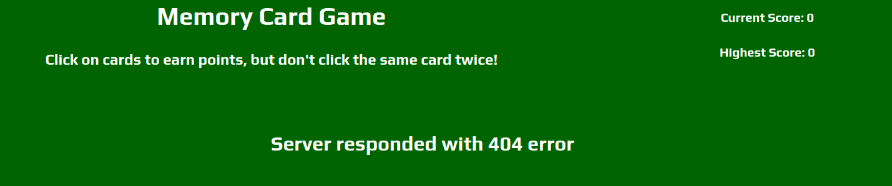
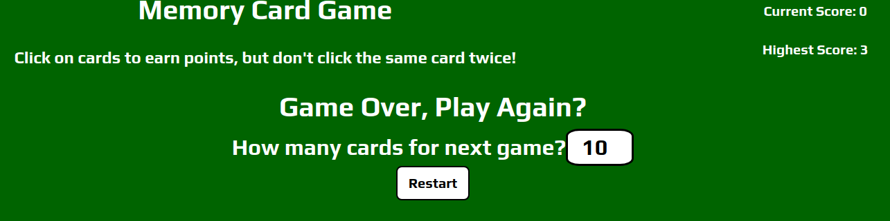
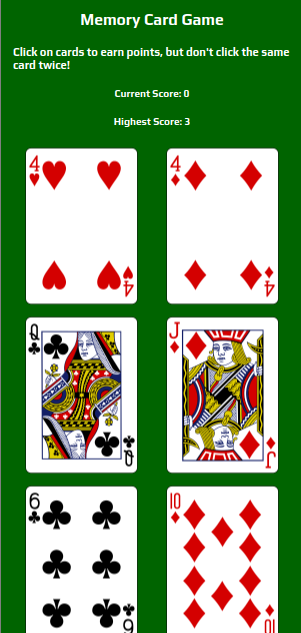
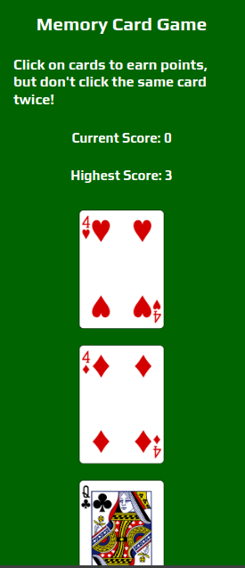

<h1>About This Project</h1> 
I wanted to make this a portfolio piece because it highlights my ability to use REST API's to retrieve and use data from an external server. It also showcases my skills and experience using React components, responsive UI design, state management, and short circuit conditionals to render data. In this project I used Axios to make API calls. I also wrote conditions to handle errors and loading screens within the API call conditions

<br> 

<h1>What I learned</h1>
    <ul>
    <li>Using Axios to retrieve data from a server</li>
    <li>How to handle errors and loading in API calls</li>
    <li>Working with React Components</li>
    <li>Passing props between components</li>
    <li>Practice using React hooks such as useState, useEffect</li>
    <li>How to correctly modify and update state in React</li>
    <li>Applying basic animations to playing cards</li>
    <li>Using and gaining experience with Bootstrap components</li>
    </ul>
<!-- <br>  -->

 <h1>Built With</h1>

 
  
 
  
 
 


<h1>Getting Started</h1>

To get project cloned locally: git clone git@github.com:alecnissen/Memory-Card.git

then ``` npm install ``` which will install all dependency's and packages.

<h1>Features</h1>

- Fully functional memory game, user gains points by clicking unique cards and user will lose the game when they click any card more than once. 

- Axios to fetch cards from an API. Also shuffles the deck of cards and gets unqiue cards for each round of play. 

- Keeps track of score, and the users highest score persists across multiple games.


- Handling and displaying errors, as well as loading screens.



- Ability for user to select how many cards for a new game. 



- Used CSS grid, flexbox, and bootstrap for styling.

- Mobile responsive 

<div>
 

</div>


<h1>Acknowledgments</h1> Thank you to everyone within The Odin Project Curriculum from the bottom of my heart! Thank you to anyone who helped me in the discord channels. I promise to help others throughout this journey. 

<h1>Contact</h1>

Creator: Alec J Nissen 
<br>
E-Mail: alecnissen@yahoo.com
<br>
GitHub: https://github.com/alecnissen/Memory-Card
<br>
Live Link: https://memory-card-game-top.netlify.app/